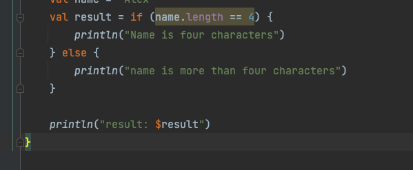
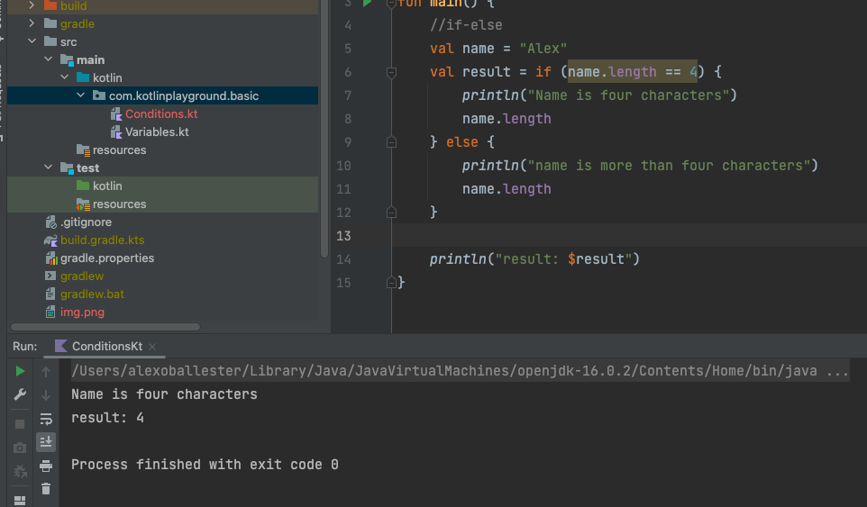
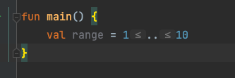
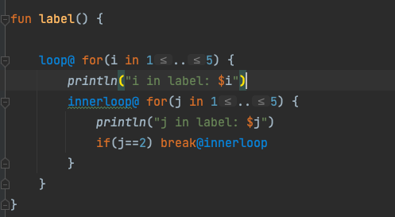

# Kotlin Introduction

Kotlin is modern OOP and functional language and is a statically typed language same as Java
- free open source language licensed under Apache 2.0

### Why Kotlin?
- expressive language and has concise syntax
  - means code is readable and maintainable
- safe language which prevents un-necessary errors
- Interoperable with java

### Var and Val
- Var are variables in Kotlin that are mutable
- Val are variables in Kotlin that are immutable

### Variable types in Kotlin

- No distinction between primitives and wrapper types
- All numbers in Kotlin are presented as types
  - Integer types: Byte, Short, Int, Long
  - Floating Types : Float, Double
  - Character Type : Char
  - Boolean Type : Boolean

### Kotlin and Java have Type inference
- meaning it can identify which type of variable is being assigned
  - in intellij you can see a prompt of "redundant type"

### String interpolation or templates
- can use by using $ + name of variable example: (println("Course: $course"))
- can use function execution by wrapping it in a curly braces: ${course.length}

### Conditionals - If and When Block

In Kotlin, If Else block is an expression, hence we can assign it to a variable and expect a result

Anytime you add a last statement, that will be the return value/type

### Loop and Range

How to create a range value in Kotlin?

Creating a label in Kotlin

### Functions

Functions are primarily used in OOP to express some behavior or some business logic

example:

fun printHello(name: String) {
  printHello("Name is: $name")
}

fun printHello(x: Int, y : Int)  : Any { <-- return an integer
  return x + y
}

// Simple approach
fun addition_2(x : Int, y : Int) = x + y

UNIT is a type that means it will not return anything
Unit corresponds to VOID of java

### Default Value Parameters and Named Arguments

Provides a value to a function when its not passed by the caller

i.e
fun printPersonDetails(name: String, email: String = "", dob: LocalDate = LocalDate.now())

Named Arguments

1. Caller can invoke the function using the variable name
2. Caller can invoke the function using the name of the function arguments, in no particular order

### Top Level Functions

Functions that does not belong to a class are top-level functions
- in Java, functions can only be part of class
- In java app, there are classes that has some static methods which holds common logic, shared across the app

Properties that does not belong to class are called top level properties

### Class

Classes are blueprint for creating objects
Note: New keyword is not needed

Constructors
are methods we use in OOP to create object with initial values

### Secondary Constructor

Alternative way of defining constructors by using constructor keyword
this() call to the actual class is mandatory

### Initializer code using init block

init code block can be used to run some initialization logic during instance creation

example:
init {
  println("iniside init block")
}

### Data class

Classes that holds data can be categorized as data classes
- DTOs domain classes and value objects are under this category
- In Java, these are known as Beans
- by adding the "data" keyword, it automatically generates the equals(), hashcode() and toStringI() methods
- data class must have at least one primary constructor parameter

Usage:
- Data classes are primarily for classes thats going to behave as a data container
- automatically generates methods such as equality(), toString() and hashcode()
- easy to create a clone by using clone()

### Inheritance

Inheritance is supported in Kotlin
Kotlin Concepts:
- Any is the superclass for any class in Kotlin
  - Object class in java
- All the classes in Kotlin are final
  - Extending classes are not allowed by default
  - Allows inheritance  only when "open" modifier is used
- Multiple inheritance of classes is not allowed

Functions can also be overridden
- Mark the function to be overridden with open modifier
- Use the keyword "override" for the function that will override the super class function
